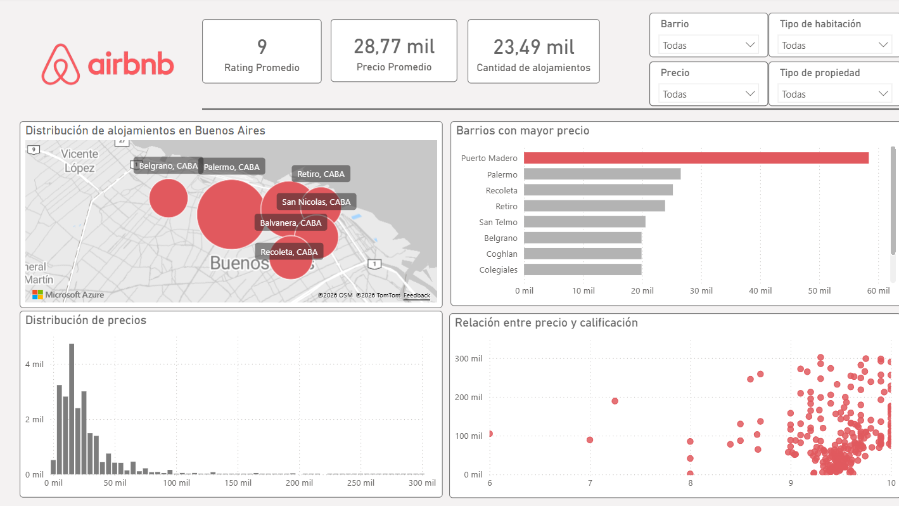
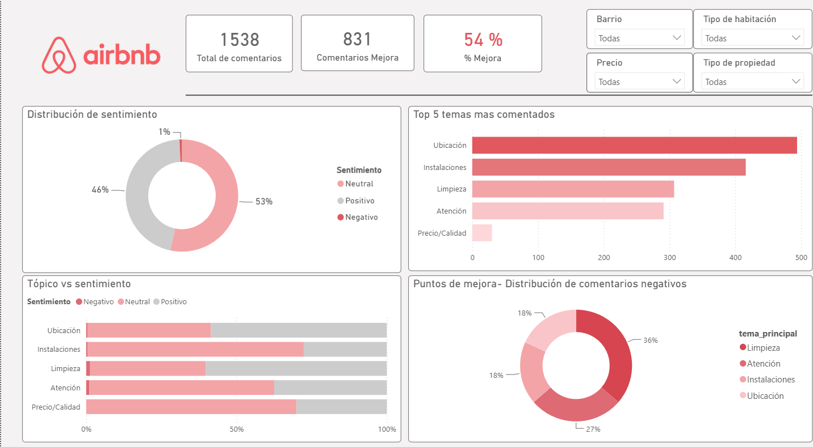

# DATA SCIENCE | Airbnb Analytics – Buenos Aires

## Data Science aplicada al sector inmobiliario temporal

Proyecto integral de **Data Science y Business Intelligence** aplicado al análisis del mercado de Airbnb en Buenos Aires.

El objetivo es transformar datos de propiedades, disponibilidad y reseñas de huéspedes en **insights accionables para analizar rentabilidad, detectar riesgos operativos y comprender la Voz del Cliente (VOC)**.

---

## 🎯 Objetivo del proyecto

El proyecto busca identificar patrones asociados a la rentabilidad de los alojamientos y detectar tempranamente factores que pueden representar riesgos para la inversión.

Para ello se integraron diferentes enfoques:

- Análisis Exploratorio de Datos (EDA)
- Data Cleaning y ETL
- Análisis de series temporales
- Análisis de sentimiento (NLP)
- Voice of Customer (VOC)
- Machine Learning
- Deep Learning
- Business Intelligence mediante Power BI

La propuesta combina **variables estructurales del alojamiento** —como precio, capacidad y disponibilidad— con **variables de experiencia del cliente**, obtenidas a partir de las reseñas.

---

# 📊 Dashboard

El análisis fue llevado a Power BI para transformar los resultados del procesamiento de datos en una herramienta de exploración y toma de decisiones.

### Exploratory Data Analysis



El dashboard permite analizar variables relacionadas con:

- Precio
- Capacidad del alojamiento
- Tipo de propiedad
- Tipo de habitación
- Barrio
- Disponibilidad
- Distribución de la oferta
- Indicadores asociados al desempeño de los alojamientos

### Voice of Customer



La segunda vista incorpora el análisis de las reseñas de huéspedes para comprender los principales factores asociados a la experiencia.

Se analizaron dimensiones como:

- Limpieza
- Atención
- Ubicación
- Precio / Calidad
- Instalaciones

El análisis de sentimiento permitió transformar texto no estructurado en variables utilizables para el análisis y el modelado.

---

# 🔎 Data Preparation & EDA

El proyecto comenzó con un proceso de **ETL y limpieza de los datasets originales de Airbnb**:

- Calendar
- Listings
- Reviews

El dataset de propiedades contaba originalmente con más de 100 variables. Luego de analizar calidad, relevancia y cantidad de valores nulos, se seleccionaron **24 variables principales** agrupadas en cuatro dimensiones:

### Variables geográficas
- Latitud
- Longitud
- Barrio

### Variables económicas
- Precio
- Depósito de seguridad
- Gastos de limpieza
- Cargos por huéspedes adicionales

### Capacidad y estructura
- Tipo de propiedad
- Tipo de habitación
- Capacidad
- Baños
- Dormitorios
- Camas

### Reputación y disponibilidad
- Rating
- Cantidad de reseñas
- Disponibilidad anual

También se realizaron transformaciones sobre variables temporales y monetarias para facilitar el análisis de precios, disponibilidad y estacionalidad.

---

# 🗣️ Voice of Customer & NLP

Las reseñas de huéspedes fueron utilizadas para incorporar la perspectiva del cliente al análisis.

Se experimentó con diferentes alternativas para el procesamiento del lenguaje natural y finalmente se utilizó **TextBlob** para obtener la polaridad de los comentarios.

La polaridad permite representar el sentimiento de cada reseña en una escala de:

**-1 → sentimiento negativo**

**+1 → sentimiento positivo**

Además, se implementó una clasificación temática mediante reglas para identificar dimensiones relevantes de la experiencia:

- Limpieza
- Atención
- Ubicación
- Precio / Calidad
- Instalaciones

De esta manera, los comentarios dejaron de ser únicamente texto y pasaron a formar parte de las variables analíticas del proyecto.

---

# 🤖 Machine Learning

La siguiente etapa consistió en construir un modelo capaz de identificar **propiedades asociadas a riesgo**, considerando las características del alojamiento y la información obtenida de las reseñas.

### Feature Engineering

Se integraron variables:

- Numéricas
- Categóricas
- Sentimiento
- Tópicos de negocio

Para el procesamiento se utilizó:

- `StandardScaler`
- `OneHotEncoder`
- `ColumnTransformer`

Debido al desbalance entre comentarios positivos y negativos, se aplicó:

**SMOTE – Synthetic Minority Over-sampling Technique**

### Modelos evaluados

Se compararon:

- Logistic Regression
- Random Forest

La evaluación se realizó mediante:

**Stratified K-Fold Cross Validation (k=5)**

Y se utilizó **F1-Score** como métrica principal debido al desbalance de clases.

La combinación de **Logistic Regression + SMOTE** presentó el comportamiento más consistente dentro de las iteraciones realizadas.

---

# 🧠 Deep Learning

Como etapa adicional se desarrolló una red neuronal utilizando:

- TensorFlow
- Keras
- Sequential Neural Network

La arquitectura incluyó:

- Capa de entrada adaptada a las variables del modelo
- Capa densa de 64 neuronas
- Capa densa de 32 neuronas
- Activación ReLU
- Dropout del 20%
- Capa de salida Sigmoid

Para evaluar el modelo se utilizó **AUC**.

El modelo obtuvo un **AUC de 0.5743**, resultado que indica una capacidad limitada para separar claramente situaciones de riesgo utilizando las variables disponibles.

Este resultado permitió identificar una conclusión importante: **la información disponible presenta señales predictivas débiles para este tipo de modelo**, por lo que la incorporación de nuevas variables podría mejorar futuras versiones.

---

# 💡 Principales Insights

El análisis permitió observar la importancia de integrar dos tipos de información:

### Variables "hard"

Características objetivas del alojamiento:

- Precio
- Capacidad
- Disponibilidad
- Ubicación
- Tipo de propiedad

### Variables "soft"

Información relacionada con la experiencia:

- Sentimiento
- Limpieza
- Atención
- Instalaciones
- Precio / Calidad

El análisis mostró que la **capacidad del alojamiento aparece como un factor relevante asociado a los ingresos**, mientras que variables vinculadas a la experiencia del huésped, como **limpieza y atención**, tienen importancia para comprender la reputación y el riesgo operativo.

---

# 🛠️ Tecnologías utilizadas

### Data Science

- Python
- Pandas
- NumPy
- Scikit-learn

### NLP

- TextBlob
- Natural Language Processing
- Sentiment Analysis
- Topic Classification

### Machine Learning

- Logistic Regression
- Random Forest
- SMOTE
- Stratified K-Fold
- Feature Engineering

### Deep Learning

- TensorFlow
- Keras

### Business Intelligence

- Power BI
- Data Visualization
- Dashboarding

---

# 📁 Estructura del proyecto

```text
DATA-SCIENCE-Airbnb-Analytics/
│
├── Images/
│   ├── EDA.png
│   └── VOC.png
│
├── Data-Science-Airbnb-Buenos-Aires.ipynb
│
├── PROJECT-DOCUMENTATION-Airbnb-Buenos-Aires.pdf
│
└── README.md
